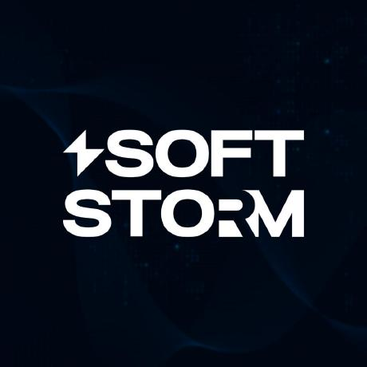

  

  <strong>Официальный профиль организации</strong>
   
  Строгие стандарты. Практическая ценность. Красивые решения.

  

  
  
  
  
  
  
  
  
  
  

  
  
  
  
  
  
  
  
  
  

  
  
  
  

---

### О нас

Мы создаём технологические продукты и инфраструктуру, фокусируясь на надёжности, безопасности и понятной архитектуре. Наша цель — превращать сложное в удобное и предсказуемое, сохраняя высокие стандарты качества.

> Мы стремимся к ощутимой ценности для пользователя, инженерной элегантности и дисциплине исполнения.

### Чем мы занимаемся

- Разработка и поддержка продуктов и внутренних платформ
- Проектирование API и интеграций
- Автоматизация CI/CD и качества
- Наблюдаемость: логи, метрики, алерты
- Техническая документация и дизайн-системы

### Выделяемся

<table>
  <tr>
    <td align="center">
      <strong>Инженерная культура</strong> 
      Дизайн-ревью, ADR, гайдлайны, менторство
    </td>
    <td align="center">
      <strong>Качество и скорость</strong> 
      CI за минуты, строгие проверки, авто-релизы
    </td>
    <td align="center">
      <strong>Надёжная платформа</strong> 
      Обсервабилити, лимиты, SLO, управляемые риски
    </td>
  </tr>
  <tr>
    <td align="center">
      
    </td>
    <td align="center">
      
    </td>
    <td align="center">
      
    </td>
  </tr>
  <tr>
    <td align="center">
      
    </td>
    <td align="center">
      
    </td>
    <td align="center">
      
    </td>
  </tr>
</table>

### Принципы

- **Прозрачность**: воспроизводимые процессы, ясные критерии готовности
- **Надёжность**: отказоустойчивость и предсказуемость важнее «магии»
- **Безопасность по умолчанию**: безопасность — часть дизайна, а не надстройка
- **Простота**: меньше скрытой сложности, больше явных контрактов
- **Ответственность**: измеряем, улучшаем, документируем

### Показатели

  
  
  
  

### Технологический стек

Мы подбираем инструменты под задачи, избегая «серебряных пуль». Типично используем:

- Backend: Node.js/TypeScript, Python
- Frontend: React, Design System, Storybook
- Данные: PostgreSQL, Redis
- Облако и платформа: Docker, Kubernetes, Terraform, GitHub Actions

### Открытые проекты

- Библиотеки и сервисы, поддерживаемые сообществом
- Шаблоны проектов с готовым CI/CD и проверками качества
- Инструменты разработчика (CLI, генераторы, линтеры)

Актуальный список — в репозиториях организации.

### Ключевые репозитории

  
<strong>EliteTravel</strong>

  - <strong>EliteTravel.Front</strong>
     
    
    
    

  - <strong>EliteTravel.Server</strong>
     
    
    
    
    

  - <strong>EliteTravel.Admin</strong>
     
    
    
    
    

  - <strong>EliteTravel.Client</strong>
     
    
    
    

  
<strong>Sunnyart</strong>

  - <strong>Sunnyart.Server</strong>
     
    
    
    

  - <strong>Sunnyart.Front</strong>
     
    
    
    

  - <strong>Sunnyart.Admin</strong>
     
    
    
    

  - <strong>Sunnyart.FileServer</strong>
     
    
    
    

  - <strong>Sunnyart.Front2</strong>
     
    

  
<strong>Прочее</strong>

  - <strong>demo.scarface</strong>
     
    
    
    

  - <strong>Landing.Front</strong>
     
    
    
    

  - <strong>Amal-SCARFACE</strong>
     
    
    
    

  - <strong>.github</strong>
     
    
    

  
<strong>Процессы</strong>

  
  - Планирование через Roadmap и приоритизацию по ценности
  - Архитектурные решения фиксируются в ADR
  - Code review обязательны, автоматические проверки блокируют мерж
  - Релизы через GitHub Actions, канареечные выкладки
  - Пост-инцидентные разборы с конкретными улучшениями

### Как присоединиться

- Открывайте задачи и обсуждения: приветствуются предложения по улучшениям
- Создавайте PR с коротким описанием мотивации и тестов
- Следуйте гайдлайнам в README соответствующих репозиториев

### Контакты

- Вопросы по сотрудничеству: укажите предпочтительный канал связи в описании организации или в закреплённых репозиториях
- Безопасность: отчёты об уязвимостях направляйте через приватный канал, указанный в SECURITY.md соответствующих проектов

---

Этот профиль поддерживается командой организации. Обновляется по мере развития проектов.

